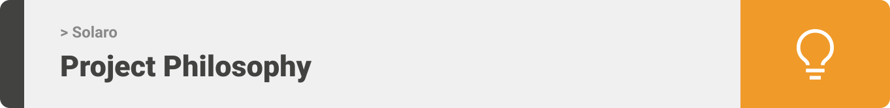
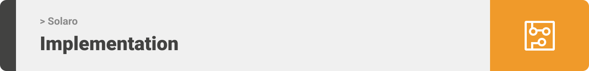

<div align="center">

> Hello world! This is the project’s summary that describes the project plain, simple, and limited to the space available.

**[PROJECT PHILOSOPHY](https://github.com/tahataha005/solaro#-project-philosophy) • [PROTOTYPING](https://github.com/tahataha005/solaro#-prototyping) • [TECH STACK](https://github.com/tahataha005/solaro#-tech-stack) • [IMPLEMENTATION](https://github.com/tahataha005/solaro#-impplementation) • [HOW TO RUN?](https://github.com/tahataha005/solaro#-how-to-run)**

</div>

<br><br>


<div align="left">

> Solaro is an IOT app that tracks solar systems charging, energy usage of individual connected items, and overall consumption.
>
> The app can control the items using arduino, and interact with the user when something wrong happens such as consumption peaks.

### User Stories

-   As a user, I want to view charging and energy usage of my solar system

-   As a user, I want to view items consumption which are connected to my solar system

-   As a user, I want to be informed about anything wrong in my system

### Controller Stories

-   As a controller, I want to add and drop items to and from my system

-   As a controller, I want to be able to control items connected to my solar system

<br><br>


> This design was planned before on [excalidraw](https://excalidraw.com/), then moved to Figma app for the fine details and animations.
> Note that i didn't use any styling library or theme, all from scratch and using pure css modules

| Log in                                                                                             | Sign up                                                                                              | Landing                                                                                              | Notifications                                                                                                    |
| -------------------------------------------------------------------------------------------------- | ---------------------------------------------------------------------------------------------------- | ---------------------------------------------------------------------------------------------------- | ---------------------------------------------------------------------------------------------------------------- |
|  |  |  |  |

| Main                                                                                           | View Item                                                                                                | Add Item                                                                                               | All Items                                                                                                |
| ---------------------------------------------------------------------------------------------- | -------------------------------------------------------------------------------------------------------- | ------------------------------------------------------------------------------------------------------ | -------------------------------------------------------------------------------------------------------- |
|  |  |  |  |

<br><br>


Here's a brief high-level overview of the tech stack the Well app uses:

-   This project uses the [Flutter app development framework](https://flutter.dev/). Flutter is a cross-platform hybrid app development platform which allows us to use a single codebase for apps on mobile, desktop, and the web.

-   For trusted database foundation, the app uses the [MongoDB Atlas](https://www.mongodb.com/atlas/database) that enables you to work with data the way you want – easily and effortlessly.

-   To send local push notifications, the app uses the [flutter_local_notifications](https://pub.dev/packages/flutter_local_notifications) package which supports Android, iOS, and macOS.

-   The app uses the font ["Inter"](https://fonts.google.com/specimen/Inter) as its main font, and the design of the app adheres to the material design guidelines.

<br><br>



> Using the above mentioned tech stacks and the wireframes built with figma from the user sotries we have, the implementation of the app is shown as below, these are screenshots from the real app

| Log in                                                                                             | Sign up                                                                                              | Log in Flow                                                                                            | Adding Systems                                                                                                 |
| -------------------------------------------------------------------------------------------------- | ---------------------------------------------------------------------------------------------------- | ------------------------------------------------------------------------------------------------------ | -------------------------------------------------------------------------------------------------------------- |
|  |  |  |  |

| Add Item                                                                                               | Main Page                                                                                           | Statistics                                                                                                 | All Items                                                                                           |
| ------------------------------------------------------------------------------------------------------ | --------------------------------------------------------------------------------------------------- | ---------------------------------------------------------------------------------------------------------- | --------------------------------------------------------------------------------------------------- |
|  |  |  |  |

| Add Item                                                                                               | Main Page                                                                                           | Statistics                                                                                                 | All Items                                                                                           |
| ------------------------------------------------------------------------------------------------------ | --------------------------------------------------------------------------------------------------- | ---------------------------------------------------------------------------------------------------------- | --------------------------------------------------------------------------------------------------- |
|  |  |  |  |

| Navigation                                                                                                    | Warning State                                                                                              | Notifications                                                                                                           | Dark Mode                                                                                                   |
| ------------------------------------------------------------------------------------------------------------- | ---------------------------------------------------------------------------------------------------------- | ----------------------------------------------------------------------------------------------------------------------- | ----------------------------------------------------------------------------------------------------------- |
|  |  |  |  |

<br><br>


> This is an example of how you may give instructions on setting up your project locally.
> To get a local copy up and running follow these simple example steps.

### Prerequisites

-   npm
    ```sh
    npm install npm@latest -g
    ```
-   ESP8266 (Hardware)

### Installation

1. Clone the repo

    ```sh
    git clone https://github.com/tahataha005/solaro.git
    ```

2. Install [Node.js](https://nodejs.org/en/)

3. Go to nodejs-server directory
    ```sh
    cd nodejs-server
    ```
4. Install npm packages
    ```sh
    npm install
    ```
5. Run the server
    ```sh
    nodemon .
    ```
6. Install [Flutter SDK](https://docs.flutter.dev/get-started/install?gclid=Cj0KCQiAveebBhD_ARIsAFaAvrEXbca0gKEuW9ROxwC86eiEtJUUO5tm-AIIzds41AXpzsjkbESCw2EaAsTwEALw_wcB&gclsrc=aw.ds)

7. Go to flutter_app directory
    ```sh
    cd flutter_app
    ```
8. Install pub packages
    ```sh
    flutter pub get
    ```
9. Run flutter_app
    ```sh
    flutter run
    ```

### Hardware Setup (Go to sumulation section to simulate hardware functionality)

-   Uploading code

1. Plug your arduino to your laptop/mac

2. Install [Arduino IDE](https://docs.arduino.cc/software/ide-v2/tutorials/getting-started/ide-v2-downloading-and-installing)(You can use alternative aurduino IDE's)

3. Upload the code found in arduino directory

<br><br>

-   Configuration

...

### Hardware Simulation

1. Go to simulator directory in arduino

    ```sh
    cd simulator
    ```

2. Change solar and item ids constants in index.js

    ```sh
    const system_id = "_Insert id here_"
    const item_id = "_Insert id here_"
    ```

3. Run server
    ```sh
    nodemon .
    ```

When applied successfully, fake data will be sent to flutter app.
