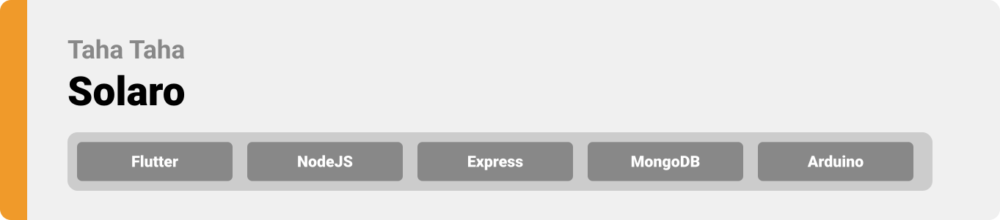
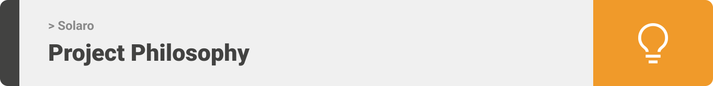
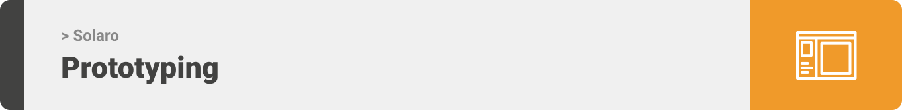
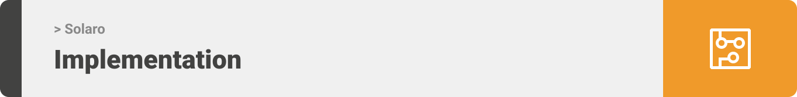

> Hello world! This is the project’s summary that describes the project plain, simple, and limited to the space available.

**[PROJECT PHILOSOPHY](https://github.com/tahataha005/solaro#-project-philosophy) • [PROTOTYPING](https://github.com/tahataha005/solaro#-prototyping) • [TECH STACK](https://github.com/tahataha005/solaro#-tech-stack) • [IMPLEMENTATION](https://github.com/tahataha005/solaro#-impplementation) • [HOW TO RUN?](https://github.com/tahataha005/solaro#-how-to-run)**

  

> Solaro is an IOT app that tracks solar systems charging, energy usage of individual connected items, and overall consumption.
>
> The app can control the items using arduino, and interact with the user when something wrong happens such as consumption peaks.

### User Stories

-   As a user, I want to view charging and energy usage of my solar system

-   As a user, I want to view items consumption which are connected to my solar system

-   As a user, I want to be informed about anything wrong in my system

  

> To be edited

  

| Login                                                                                             | Landing                                                                                              | Notifications                                                                                                    | Main                                                                                                   |
| ------------------------------------------------------------------------------------------------- | ---------------------------------------------------------------------------------------------------- | ---------------------------------------------------------------------------------------------------------------- | ------------------------------------------------------------------------------------------------------ |
|  |  |  |  |

| Add Item                                                                                       |
| ---------------------------------------------------------------------------------------------- |
|  |

  
