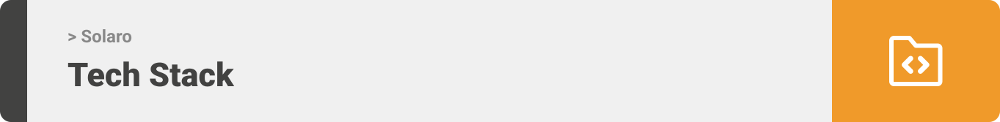

> Hello world! This is the project’s summary that describes the project plain, simple, and limited to the space available.

**[PROJECT PHILOSOPHY](https://github.com/tahataha005/solaro#-project-philosophy) • [PROTOTYPING](https://github.com/tahataha005/solaro#-prototyping) • [TECH STACK](https://github.com/tahataha005/solaro#-tech-stack) • [IMPLEMENTATION](https://github.com/tahataha005/solaro#-impplementation) • [HOW TO RUN?](https://github.com/tahataha005/solaro#-how-to-run)**

  

> Solaro is an IOT app that tracks solar systems charging, energy usage of individual connected items, and overall consumption.
>
> The app can control the items using arduino, and interact with the user when something wrong happens such as consumption peaks.

### User Stories

-   As a user, I want to view charging and energy usage of my solar system

-   As a user, I want to view items consumption which are connected to my solar system

-   As a user, I want to be informed about anything wrong in my system

### Controller Stories

-   As a controller, I want to add and drop items to and from my system

-   As a controller, I want to be able to control items connected to my solar system

  

> This design was planned before on [excalidraw](https://excalidraw.com/), then moved to Figma app for the fine details and animations.
> Note that i didn't use any styling library or theme, all from scratch and using pure css modules

| Log in                                                                                             | Sign up                                                                                              | Landing                                                                                              | Notifications                                                                                                    |
| -------------------------------------------------------------------------------------------------- | ---------------------------------------------------------------------------------------------------- | ---------------------------------------------------------------------------------------------------- | ---------------------------------------------------------------------------------------------------------------- |
|  |  |  |  |

| Main                                                                                           | View Item                                                                                                | Add Item                                                                                               | All Items                                                                                                |
| ---------------------------------------------------------------------------------------------- | -------------------------------------------------------------------------------------------------------- | ------------------------------------------------------------------------------------------------------ | -------------------------------------------------------------------------------------------------------- |
|  |  |  |  |

  

Here's a brief high-level overview of the tech stack the Well app uses:

-   This project uses the [Flutter app development framework](https://flutter.dev/). Flutter is a cross-platform hybrid app development platform which allows us to use a single codebase for apps on mobile, desktop, and the web.

-   For trusted database foundation, the app uses the [MongoDB Atlas](https://www.mongodb.com/atlas/database) that enables you to work with data the way you want – easily and effortlessly.

-   To send local push notifications, the app uses the [flutter_local_notifications](https://pub.dev/packages/flutter_local_notifications) package which supports Android, iOS, and macOS.

-   The app uses the font ["Inter"](https://fonts.google.com/specimen/Inter) as its main font, and the design of the app adheres to the material design guidelines.

  

  
